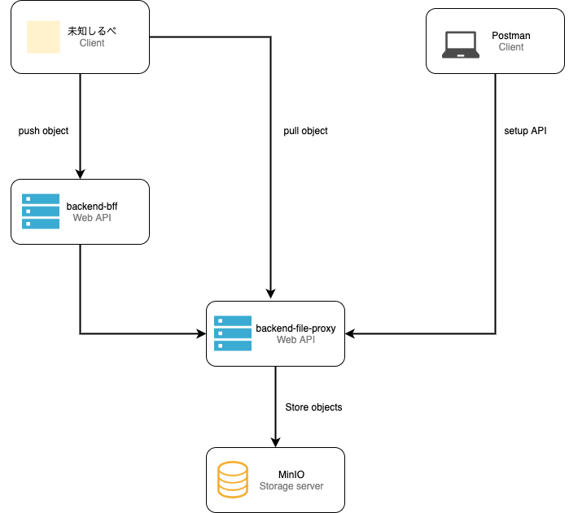

# backend-file-proxy

  

The `backend-file-proxy` API is one of the services of [mirai-cluster](https://github.com/miraikeitai2020/mirai-cluster) developed by Future Mobile Phone Project 2020.  

## Description
### Architecture overview

### Building from source
The Makefile provides several targets:  

build: build the backend-file-proxy  
test: run the tests  
docker: build a docker container for the current HEAD  
minio-run: launch minio container on docker  

## Contributing
- [Commit Rules](./docs/commit_rules.md)
- [Branch Rules](./docs/branch_rules.md)
- [Issue Rules](./docs/issue_rules.md)
